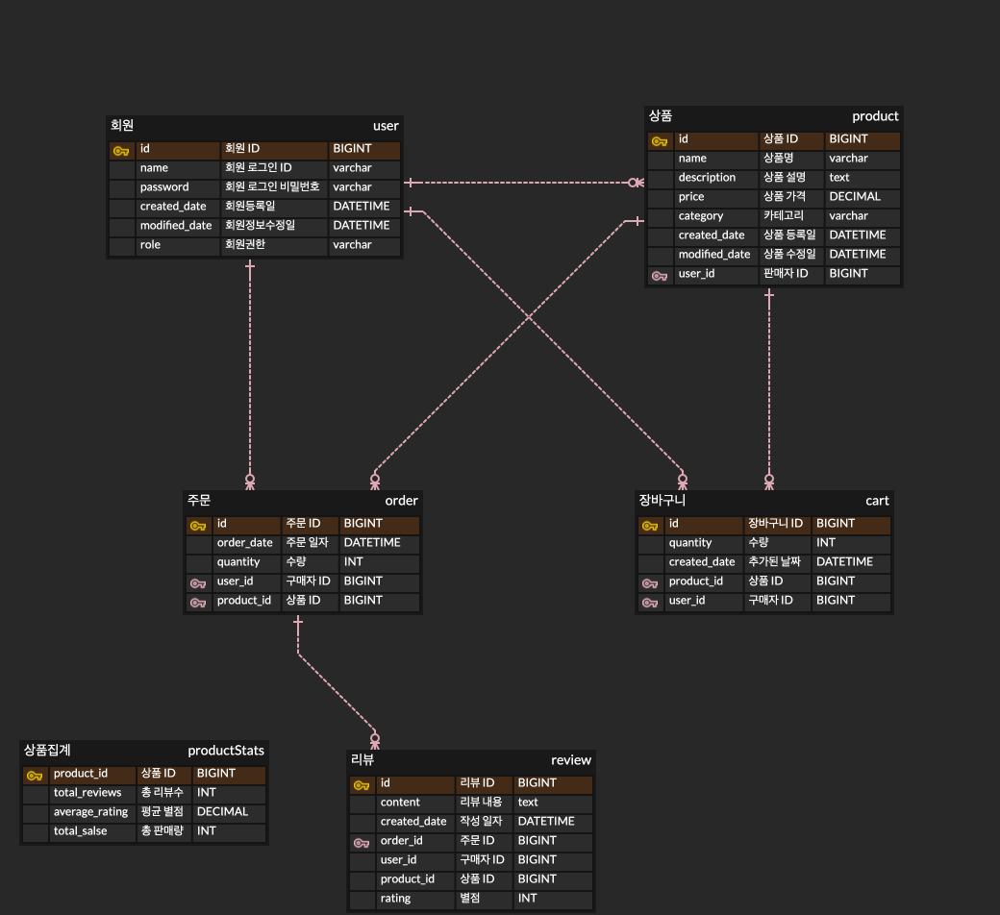

# 🖥️ E-Commerce 구현하기

---

>온라인 쇼핑몰에서 상품을 등록, 조회하고 장바구니 기능을 이용하는 서비스입니다.

## 프로젝트 기능 및 설계

---

- 회원가입 기능
  - 사용자는 회원가입을 할 수 있다. 회원가입시 SELLER와 BUYER 권한을 선택하여 지닌다.
  - 회원가입시 아이디와 패스워드를 입력받으며, 아이디는 unique 해야한다.
- 로그인 기능
  - 사용자는 로그인을 할 수 있다. 로그인시 회원가입때 사용한 아이디와 패스워드가 일치해야 한다.
- 상품 등록 기능
  - 로그인을 한 사용자 중 SELLER 권한을 지닌 사용자는 상품을 등록할 수 있다.
  - 상품 등록시 상품명, 상품 가격, 상품 정보에 대한 정보가 필요하다.
  - 등록한 상품은 수정 및 삭제할 수 있다.
- 상품 목록 조회 기능
  - 로그인을 하지 않은 사용자를 포함한 모든 사용자는 상품을 조회할 수 있다.
  - 상품은 카테고리별로 나뉘며 각 카테고리 안에 상품들은 최신순으로 기본 정렬된다.
  - 정렬 기능으로는 리뷰 많은순, 판매 많은순, 높은 가격순, 낮은 가격순이 있다.
  - 상품 목록 조회시 응답에는 상품 이름, 판매자, 상품 가격, 리뷰 수, 평균 별점의 정보가 필요하다.
  - 상품이 많을 수 있으므로 paging 처리를 한다.
- 특정 상품 조회 기능
  - 로그인을 하지 않은 사용자를 포함한 모든 사용자는 특정 상품을 조회할 수 있다.
  - 상품 이름, 판매자, 상품 등록 일시, 가격, 상품 정보가 조회된다.
- 상품 장바구니 기능
  - 로그인을 한 사용자 중 BUYER 권한을 지닌 사용자는 상품을 장바구니에 담을 수 있다.
  - 장바구니를 조회하면 장바구니에 담았던 상품들이 조회된다.
  - 장바구니에 담긴 상품을 삭제할 수 있다.
- 리뷰 목록 조회 기능
  - 특정 상품 조회시 리뷰 목록도 함께 조회된다.
  - 리뷰는 최신으로 정렬되며, paging 처리를 한다.
  - 리뷰 목록 조회시에는 리뷰 작성자와 리뷰 내용, 리뷰 작성일, 별점의 정보가 필요하다.
- 리뷰 작성 기능
  - 로그인하고 해당 상품을 구매한 이력이 있는 사용자는 댓글을 작성할 수 있다.
  - 사용자는 댓글 내용을 작성할 수 있다.

## ERD

---

## Trouble Shooting

---
[the trouble shooting page 👉](doc/TROUBLE_SHOOTING.md)

## Tech Stack

---

